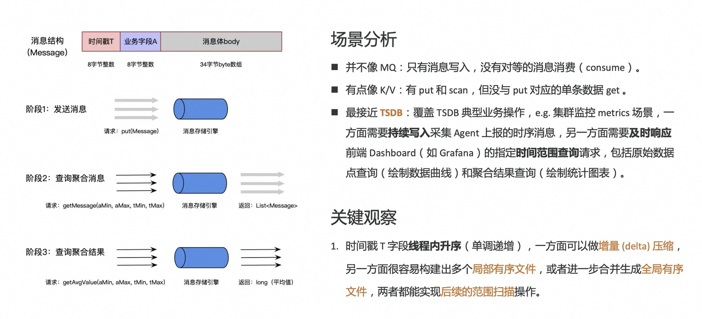
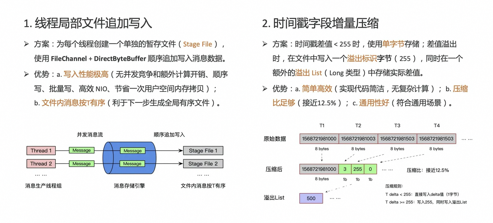
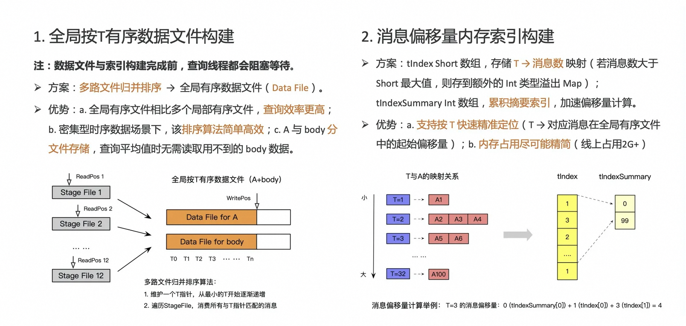
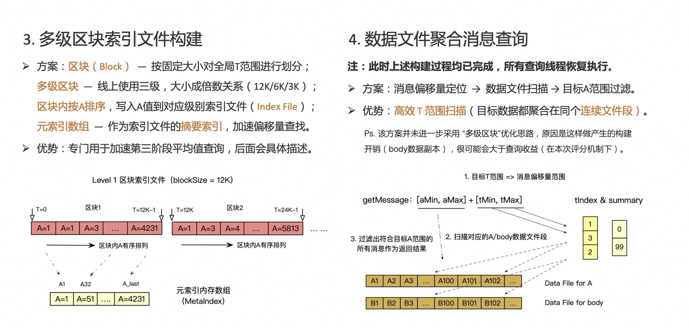
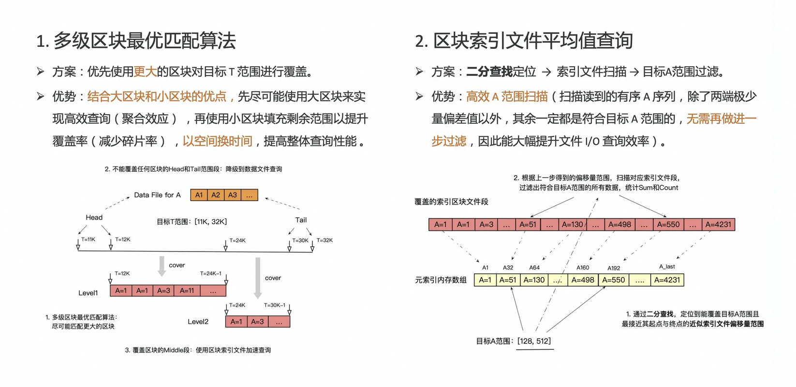

# In-process Message Queue

> 赛事介绍：[第五届中间件性能挑战赛_程序设计大赛_天池大赛](https://tianchi.aliyun.com/competition/entrance/231714)
> 
> 赛题介绍：[实现一个进程内基于队列的消息持久化存储引擎（复赛）](CONTEST.md)

## 赛题背景分析及理解

### 功能需求

实现一个进程内消息持久化存储引擎，支持：  

- 发送消息：单条消息由时间戳字段 t、业务字段 a 和消息体 body 三个部分组成。  
- 根据一定的条件做查询或聚合计算：a. 查询一定时间窗口内的消息；b. 对一定时间窗口内的 a 字段求平均值。

### 评测方式

分为3个阶段，最终分数为各阶段分数之和：  

- 发送阶段：多线程发送；时间戳 t 线程内升序；分数 = 发送消息总数 / 发送耗时。  
- 消息大小：总大小50字节，其中 t 和 a 字段各8字节，body 数据34字节。  
- 消息条数：20亿条左右（总数据量：20亿 * 50Byte = 100GB左右）。  
- 查询聚合消息阶段：返回以 t 和 a 为条件的消息, 按 t 升序排列；分数 = 查询消息总数 / 查询耗时。  
- 查询聚合结果阶段：返回以 t 和 a 为条件对 a 求平均的值；分数 = 查询消息总数 / 查询耗时。

### 题目限制

- 机器配置：4核8G + 300G SSD（iops：1w；块读写能力：200MB/s）
- JVM限制：4G堆内存，2G堆外内存
- 编码限制：仅允许依赖JDK原生库；不允许使用jni、jna、direct IO；允许使用堆外内存。

### 场景分析

乍一看以为是要写消息队列（MQ），实际上并不是：

- 并不像 MQ：只有消息写入，没有对等的消息消费（consume）；
- 有点像 K/V：有 put 和 scan，但没与 put 对应的单条数据 get ；
- 最接近 **TSDB**：覆盖 TSDB 典型业务操作，e.g. 集群监控 metrics 场景，一方面需要**持续写入**采集 Agent 上报的时序消息，另一方面需要**及时响应**前端 Dashboard（如 Grafana）的指定**时间范围查询**请求，包括原始数据点查询（绘制数据曲线）和聚合结果查询（绘制统计图表）。

所以，这其实是一道关于 TSDB（时间序列数据库）的题。

### 关键观察

- a 与 body 字段总数据量都远大于内存限制，且都是随机数据；
  - → 压缩空间较小，必须做持久化存盘。
- 时间戳 T 字段**线程内升序**（单调递增）；
  - → 一方面，可以做**增量（delta）压缩**；另一方面，很容易构建出多个**局部有序文件**，或者进一步合并生成**全局有序文件**，两者都能实现后续的**范围扫描**操作。

## 核心思路：发送消息阶段

1. **线程局部文件追加写入**

- **方案**：
  - 每个线程创建一个单独的暂存文件（**Stage File**），putMessage时先根据线程ID找到对应的StageFile。
  - 写入消息到 StageFile 时，使用 **FileChannel** + **DirectByteBuffer**（buffer大小 = 4K * 消息大小） 直接追加写入；具体到单个消息，会按顺序依次写入 T、A 和 body。
- **优势**：
  - **写入性能极高**：无并发竞争开销；无额外计算和存储；对于磁盘文件而言，追加写比随机写更快，基于内存 buffer 方式的批量写也比逐个单写更快；在Java文件I/O层面，使用 FileChannel 等NIO接口比普通I/O接口更快，而使用堆外的 DirectByteBuffer 相比堆内的 HeapByteBuffer 也能节省一次用户空间内存拷贝。
  - **文件内消息按T有序**：题目中有说明，每个线程写入的消息时间戳T字段都是（非严格）单调递增的，因此使用这种写入方式产生的每个文件，其所有消息在文件内都是按 T 有序排列的。基于这个有序特性，能够直接实现较为高效的数据查询（例如二分查找），也可以进一步使用归并排序生成更有用的全局有序数据文件。

2. **时间戳字段增量压缩**

- **方案**：
  - 由于时间戳是单调递增的，且前后两个消息的时间戳差值一般都很小（符合真实场景的时间序列数据特征），绝大部分都可以用单个byte存储（< 255）。
  - 对于差值溢出的情况（>= 255），该算法一方面会在文件中写入一个255的byte（用于标识当前位置差值发生溢出），另一方面会在一个额外的overflowList（long类型）中存储这个溢出的差值；对应地，读取消息时如果发现读到的T差值是255，则改为从overflowList中拉取实际的T差值。
- **优势**：
  - **简单高效**：相比其他复杂的通用压缩算法，该特定增量压缩算法非常简单直观，实现代码简洁（压缩+解压总共10行左右代码），可维护性强，且没有复杂计算逻辑，几乎不占用CPU资源。
  - **压缩比足够**：虽然按照压缩理论，还有进一步压缩时间戳数据的空间，但实际测试这种简单的压缩算法已经能有比较好的效果，压缩比能近似达到12.5%（99%以上的8字节时间戳都可以被压缩为1字节的增量）。
  - **通用性好**：该压缩算法所假定的输入数据特征符合通用的时间序列场景，且能应用到任何单调递增序列数据。

## 核心思路：查询聚合消息阶段

**整体思路**：进一步划分为两个子阶段，分别完成文件与索引构建，和实际的聚合消息查询。

**子阶段一**： 读取所有StageFile，**并发构建**生成后续查询阶段会用到的数据文件、索引文件和内存索引；执行子阶段1时，所有查询聚合消息线程都会处于等待状态，直到子阶段1完成。

1. **全局按T有序数据文件构建**

- **方案**：
  - 本质上是对所有按T有序的StageFile执行一次**多路文件归并排序**，最终生成一个全局按T有序的逻辑数据文件（DataFile，底层物理存储实际有两个文件，一个存A，一个存body）。
  - 多路排序算法是针对时间戳类型排序关键字（T）**定制设计**的：从T的起始位置开始不断递增，对于每个T再去遍历所有StageFile，消费与当前T匹配的消息，写入全局有序的数据文件，并执行附属的索引构建相关动作。
- **优势**：
  - 构建出的全局按T有序数据文件，能够很好地满足后两个阶段的**按T范围查询**需求，因为待扫描的目标数据都是聚合存储在单个全局文件下，与目标T范围匹配的某个连续文件段中。
  - 定制的多路归并排序算法，一方面实现简单，可维护性好；另一方面针对该类时序数据场景（消息并发量大，时间戳数据密集），效率会比其他通用方案（例如将文件列表维护在一个PriorityQueue中）要更高些。
  - A和body使用不同的全局文件存储，可以让查询平均值阶段无需读取用不到的body数据，提升查询效率。

2. **消息偏移量内存索引构建**

- **方案**：
  - 维护一个short类型内存数组（**tIndex**），用于存储所有“T -> 包含该T的消息数”的映射关系。  
    如果消息数超出了short类型最大值，则将溢出值存储到额外的内存HashMap（**tIndexOverflow**）中。  
    另外还会维护一个int类型内存数组（**tIndexSummary**），作为tIndex数组的累积索引，构建方法：每隔一定个数（64）的T，存储一个截止到目前T为止的总消息量，用于加速消息偏移量计算。
- **优势**：
  - 给定任意T，支持**快速精准定位**到包含该T的第一个消息在整个全局有序文件中的偏移量（最多只需要64次内存索引数组查询操作）；通过该偏移量可进一步在数据文件、索引文件中精准定位到待查找的数据。
  - **内存占用尽可能精简**：使用原生类型数组存储，节省对象封装内存开销；将最小的T对齐到数组的位置0，充分利用数组空间；数据类型为short，可以用2 byte存储绝大部分消息数（溢出时会使用额外的HashMap存储）。线上实际测试，该内存索引的总内存占用量是2G多一点（总内存限制是4G）。

3. **多级区块索引文件构建**

- **方案**：
  - **区块（Block）**：按照固定大小对全局T范围进行区块划分，e.g. 假设区块大小为1024，则 0 <= T < 1024 的所有消息都属于同一个区块。
  - **多级区块**：设置多级区块大小，尽可能确保不同级别的区块大小成**倍数关系**（线上最好成绩版本是使用了3级区块，各级区块大小分别为：12K、6K、3K）。
  - 构建数据文件过程中，对于每个级别区块，将落入该级别同一区块内的所有消息的A字段，**按A值大小进行内存排序**，再批量写入对应级别的区块索引文件（**IndexFile**）。
  - 额外地，针对每个级别的区块还会维护一个**元索引（MetaIndex）**数组；该元索引的构建方法：每隔一定个数（32）的消息，将消息的A写入到该元索引数组，用于加速查找给定A范围在索引文件中的起点/终点偏移量。
- **优势**：
  - 该索引文件专门用于**加速第三阶段的聚合结果查询**，具体优势详见下文<区块索引文件查询方案>部分描述。
  - 构建多级区块，是为了进一步以**空间换时间**，具体优势详见下文<多级区块最优匹配算法>部分描述。

**子阶段二**：此时子阶段一的文件和索引构建已完成，所有查询聚合消息请求线程都会恢复执行。

4. **数据文件聚合消息查询**

- **方案**：
  - 消息偏移量定位：通过上述“消息偏移量内存索引”，分别查找到给定T范围起点和终点的消息偏移量。
  - 数据文件扫描：有了偏移量起始值后，即可直接扫描数据文件的对应文件段（与写文件类似，也是基于FileChannel + DirectByteBuffer）；对扫描出的每个消息，再进一步过滤出符合A范围条件的所有消息。
- **优势**：
  - 该方案实现了基于全局按T有序的数据文件的**精准T范围扫描**，相比去直接扫描原始的StageFile（需要遍历每个StageFile，扫描各自文件中符合要求的消息，再做一次结果合并），效率要更高。
  - 不过该方案并未采用上述“多级区块索引文件”的优化思路，来进一步减少文件I/O开销；原因是这样做还需要再存一份较大的有序body索引文件副本，构建的开销很可能会大于查询时的收益（在本次评分机制下）。

## 核心思路：查询平均值阶段

**整体思路**：将请求的T范围与多级区块之间进行最优覆盖匹配，对于能完全覆盖的T范围段就走索引文件查询，剩余的T范围段就降级到普通的数据文件查询（与上一阶段的聚合消息查询类似）。

1. **多级区块最优匹配算法**

- **方案**：
  - 先根据所有级别中的**最小区块大小**，将请求T范围划分为三部分：**头部**（从T起点，到最近一个区块的起点）、**中部**（从T范围覆盖的第一个区块起点，到最后一个区块终点）、**尾部**（从最后一个区块终点，到T终点）。
  - 对于头部和尾部，由于不能完整覆盖任何区块（最小的都不能覆盖），因此直接降级到普通的数据文件查询。
  - 对于中部，优先尝试使用更大的区块覆盖，方法如下：维护一个当前T位置；从大到小依次尝试匹配各个级别的区块，如果能够匹配上则使用该级别的索引文件进行聚合结果查询，否则再尝试下一级别（至少能够匹配上最小区块大小对应级别的索引文件）。
  - 所有这些子查询（数据文件或索引文件）都是返回对应T范围段符合条件的A值累积和（Sum）与数目（Count）；最外层会将这些子查询的结果做进一步的合并，计算得到最终的平均值结果。
- **优势**：
  - 如果只使用单级区块，则必然要在区块大小选择上做出权衡：区块越大的索引文件，**查询效率**越高（批量聚合效应），但对任意随机T范围的**覆盖率**也越低（不能匹配的碎片范围越大）；相反地，区块越小的索引文件，查询效率越低，但对任意随机T范围的覆盖率也越高。
  - 通过引入多级区块，且确保各级区块大小是倍数关系时，该最优匹配算法能够**结合大区块和小区块的优点**，先尽可能使用大区块来实现高效查询（聚合效应），再使用小区块来填充剩余范围以提升覆盖率（减少碎片率），以空间换时间，提高整体查询性能。

2. **区块索引文件平均值查询**

- **方案**：
  - 执行到该阶段子查询时，说明当前目标区块内的所有A都已经是符合T范围条件的，只需再进一步在目标区块中找出符合A范围条件的所有A即可。
  - 由于同一区块中的A是有序排列的，可以先通过元索引以**内存二分查找**的方式，分别定位到最接近A范围起点与终点的**近似索引文件偏移量**，将扫描范围进一步缩小；接下来直接扫描该偏移量范围内的索引文件段，并过滤出符合A范围条件的所有A，统计Sum和Count后返回即可。
- **优势**：
  - **精准A范围扫描**：基于MetaIndex二分查找得到的近似文件偏移量范围，一方面能确保覆盖实际符合A范围条件的文件偏移量范围，另一方面两者的**距离相差不会超过构建MetaIndex时的间隔数**（即32）。因此，后续扫描时读取出来的所有A，除了两端的少量值以外（加起来不超过64个），其余一定是符合A范围的，无需再做进一步过滤，**大幅提升文件I/O查询效率**（性能瓶颈点）。

**经验总结**

- 牢记“2/8”原则，优先寻找和优化当前系统瓶颈点，而不是浪费时间在小的优化项上。
- 即使是面向跑分的比赛，编写干净优雅的代码依然很重要，否则会浪费很多时间去复制粘贴和排查bug。
- 有条件的话要尽可能模拟真实评测环境（比如官方提供的 [Web+](https://www.aliyun.com/product/webx) 评测环境一键搭建工具），减少优化效果偏差。
- 更多优化经验，参考我的文章「[服务端问题排查与系统优化](https://mp.weixin.qq.com/s/AYf-sUv2StODBx-10_K0Sg)」。
